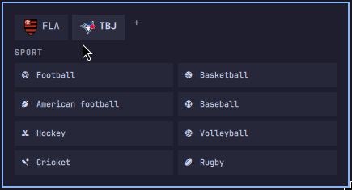
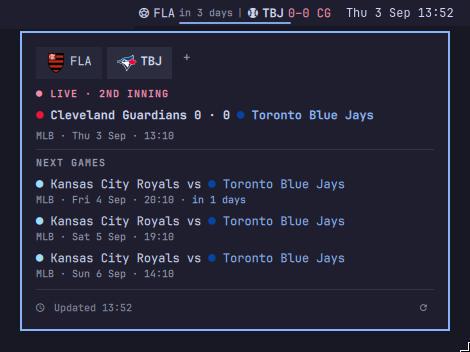

# Omarchy Follow Your Team

Keep your favourite teams right at the top bar. Follow up to four teams across different sports and quickly check their latest results and upcoming games.

When it’s game time, Live Mode keeps you in the action with automatic score updates as the match unfolds.





## Features

- Follow up to four teams across football, basketball, American football, baseball, hockey, volleyball, cricket, and rugby.
- Search teams after selecting a sport; selected teams are saved in the bar configuration.
- Show every followed team in the bar, including a smaller next-fixture countdown.
- Show live scores and period/status in the bar; retain a finished score for eight hours.
- Use team crests and small club-colour markers while keeping fixture text compatible with Omarchy themes.
- Show the selected team’s latest result, next three fixtures, update time, and refresh control in a compact panel.

## Install

```sh
omarchy plugin add https://github.com/paulohenrique000/omarchy-follow-your-team.git --enable
```

If you do not choose placement during installation, move it to the centre bar section:

```sh
omarchy bar move io.github.paulohenrique000.team-matches --section center
```

## Use

1. Click the widget in the bar.
2. Select a sport, then search for and select a team.
3. Use the `+` tab to add up to three more teams.
4. Click a team tab to view its details.
5. Middle-click the bar widget or use the refresh button in the panel to refresh.

## Data and refresh behaviour

This plugin uses public SofaScore web endpoints for team/event data. No account, API key, or elevated permissions are required.

- Team schedule summaries refresh every 30 minutes.
- During a live match, the plugin polls that match's individual event endpoint once per minute.
- A recently completed result remains in the bar for eight hours.

SofaScore does not publish these endpoints as a supported public API. They may change or return a temporary anti-bot challenge (`403`). This plugin deliberately limits polling, but it cannot guarantee availability or coverage.

## Security and privacy

Runs in the user shell and calls SofaScore via `bash`/`curl`.

## Development

```sh
omarchy plugin validate .
qmllint -I "$OMARCHY_PATH/shell" BarWidget.qml Panel.qml
```

To test a local checkout, link or copy this repository into `~/.config/omarchy/plugins/io.github.paulohenrique000.team-matches/`, then enable it with `omarchy plugin enable io.github.paulohenrique000.team-matches`.

## Remove

```sh
omarchy plugin remove io.github.paulohenrique000.team-matches --yes
```

## License

[MIT](LICENSE)
